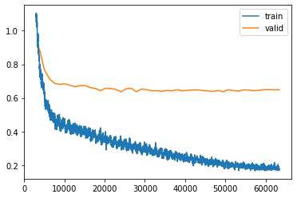

## Ссылки

1. [link](https://drive.google.com/drive/folders/1a1OwG0gUEovQLiMSIfiSHA2g3DsZ62P0?usp=sharing) Датасет (1.4GB)
1. [link](https://drive.google.com/drive/folders/1SSY4fbwMQT_EXw_GMkKOXJKCHnxpFxob?usp=sharing) Папка со всеми `*.ipynb` файлами на Google Drive
1. [link](https://drive.google.com/drive/folders/17yqFYCbqAAskolqhiGiWLm_JKiStb-IU?usp=sharing) Папка с промежуточными файлами (pytorch модель, `*.npz` архивы) на Google Drive

## Задание

### Пример данных

**Product 889**


```
product_id     889
category_id    11508
category_name  "Все категории->Обувь->Женская обувь->Шлепанцы и сланцы"
sale           False
shop_id        191
shop_title     "SOVA"
rating         5.0
text_fields    """{
	'title' : 'Шлепанцы женские',
	'description' : '<p>Женские тапки с открытым мысом выполненные из текстиля, со стелькой из льна, помогут отдохнуть вашим ногам после трудового дня. Эластичная резиновая подошва полностью повторяет изгиб стопы при движении.</p><p>Размер по стельке:</p><p>37 - 230 мм</p><p>39 - 240 мм</p><p>40 - 250 мм</p>',
	'attributes' : ['Состав верха: текстиль', 'Состав подошвы: резина', 'Страна-производитель: Китай', 'Шлепанцы', 'Размер: в описании товара'],
	'custom_characteristics' : {},
	'defined_characteristics' : {
		'Женский размер обуви RUS' : ['36', '40', '35', '39', '38', '37'],
		'Цвет' : ['Темно-синий', 'Розовый', 'Фиолетовый', 'Коричневый', 'Красный']
	},
	'filters' : {
		'Цвет' : ['Фиолетовый', 'Фиолетовый', 'Красный', 'Красный', 'Фиолетовый', 'Фиолетовый', 'Фиолетовый', 'Красный', 'Красный', 'Красный'],
		'Размер обуви RUS' : ['39', '35', '35', '37', '36', '38', '37', '38', '36', '39']
	}
}"""
```

**Product 216**


```
product_id     216
category_id    12907
category_name  "Все категории->Товары для дома->Товары для кухни->Кухонные аксессуары->Зажимы кухонные"
sale           True
shop_id        67
shop_title     "KAYAKI"
rating         4.9375
text_fields    """{
 'title': 'Зажим для пакетов / набор зажимов 5 штук',
 'description': '<p class="ql-align-justify">Пластиковые зажимы для пакетов с крупами, специями, сахаром, мукой и так далее</p><p class="ql-align-justify"></p><p class="ql-align-justify">Чтобы не просыпались сыпучие продукты из открытых пакетов используйте данные зажимы. Удобны в использовании</p><p class="ql-align-justify"></p><p class="ql-align-justify">Плотно зажимают пакет и легко расстегиваются при необходимости. Достаточно отодвинуть в строну пластиковую защелку. В комплекте 5 шт. разных цветов</p><p class="ql-align-justify"></p>',
 'attributes': ['В комплекте 5 шт.', 'Прочная', 'Легко растегивается', 'Плотно зажимает пакеты', 'Цвет ассорти'],
 'custom_characteristics': {},
 'defined_characteristics': {},
 'filters': {'Бренд': ['KAYAKI']}}"""
```

### Описание задачи

На нашем маркетплейсе ежедневно появляются сотни новых товаров. Однако, проверить правильность заполнения информации обо всех товарах сразу невозможно. Неверно определенная категория зачастую приводит к потенциально упущенной прибыли как со стороны продавца, так и со стороны маркетплейса. Мы хотим научиться предсказывать категорию на основе описания, картинки и других параметрах товаров.

### **Формат входных данных**

**train.parquet** - `pandas.DataFrame` с товарами на маркетплейсе. У каждого товара есть:

* *product_id* - *идентификатор товара*

* *text_fields* строка-словарь со следующими полями:

  * *title - заголовок*
  * *description - описание*
  * *attributes - на сайте они находятся в карточке товара*

  * *custom_characteristics, defined_characteristics, filters - вложенные словари с ключами – названиями полей-признаков и значениями – возможными значениями этих признаков (например, Цвет: Белый / Черный)*

* *rating - средний рейтинг товара*

* *sale* - *флаг, обозначающий находится ли товар в распродаже*

* *shop_id (seller_id) - id магазина (id-продавца)*

* *shop_title* - *название магазина*

* *category_id - категория товара (таргет)*

* *category_name - название категории товара с точки зрения дерева категорий KazanExpress*

**test.parquet** - файл, идентичный **train.parquet**, но без реального *category_id*, именно его вам и предстоит предсказать.

**images** – папка с двумя подпапками: **train** и **test** для картинок товаров из, соответственно,  обучающей и тестовой выборки. Названия файлов соответствуют **product_id** товаров.

### Метрики

Целью задания является предсказание категории товара. Соответственно, надо решить задачу многоклассовой классификации. В качестве метрики для задания выбран [взвешенный F1-score](https://scikit-learn.org/stable/modules/generated/sklearn.metrics.f1_score.html)

$$F_{weighted} = 2 \cdot {P_{weighted} \cdot R_{weighted} \over P_{weighted} + R_{weighted}}$$

где

$P_{weighted}$ - взвешенный $Precision$

$R_{weighted}$  - взвешенный $Recall$

### Формат решения

Файл `result.parquet` должен содержать две колонки:

* **product_id** - идентификатор товара из `test.parquet`
* **predicted_category_id** - категория, предсказанная вашей моделью, для соответствующего **product_id**

## Результаты

Использованная модель: **RuBERT text embeddings** + **kNN**

Качество на валидации (test split: 0.1): **0.8562** F1 score

## Для воспроизведения результата

(Готовые файлы можно найти в [папке](https://drive.google.com/drive/folders/17yqFYCbqAAskolqhiGiWLm_JKiStb-IU?usp=sharing) на Google Drive)

1. Токенизировать тексты с помощью `01_rubert-tokenizer.ipynb`
   * Будут созданы файлы:
     * `tokens_rubert_test.npz`
     * `tokens_rubert_train.npz`
     * `tokens_rubert_val.npz`
1. Дообучение модели RuBERT (fine-tuning) с помощью `02_fine-tune-rubert.ipynb`
   * Будет создана pytorch модель:
     * `models/fine-tune-bert_0_765561/*` (~700MB)
   * Можно пропустить этот шаг и скачать готовую модель с [диска](https://drive.google.com/drive/folders/17yqFYCbqAAskolqhiGiWLm_JKiStb-IU?usp=sharing). Она понадобится на следующем шаге.
1. Сгенерировать эмбеддинги для текстовых описаний с помощью `04_rubert-text-embeddings.ipynb`
   * Будут созданы файлы:
     * `embeddings_text_test.npz`
     * `embeddings_text_train.npz`
     * `embeddings_text_val.npz`
1. Сгенерировать финальные предсказания на тестовом датасете с помощью `12_final-predictions.ipynb`
   * Будет создан файл:
     * `result.parquet`

### Примечания

1. Вся работа была выполнена в среде Google Colab.
1. В файле `05_knn.ipynb` подбирается оптимальное значение гиперпараметра `TOP_K` для алгоритма kNN.
1. Обучение MLP классификатора вместо kNN увеличивает метрику на `0.01`
1. Эмбеддинги изображений увеличивают метрику на `0.005`
1. Решил остановиться на текстовых эмбеддингах + kNN: простота + сравнимая точность.

## Подробности

Этапы исследования:

* [`01_rubert-tokenizer.ipynb` - препроцессинг+токенизация текстов для RuBERT](#01_tokenizer)
* [`02_fine-tune-bert.ipynb` - дообучение модели RuBERT (fine-tuning)](#02_rubert_fine-tuning)
* [`04_rubert-text-embeddings.ipynb` - генерация эмбеддингов (embeddings) с помощью дообученной модели](#03_rubert_embeddings)
* [`05_knn.ipynb` - предсказание категории с помощью kNN на валидации](#04_knn_validation)
* [`06_mlp-classifier.ipynb` - обучение MLP классификатора](#05_mlp_classifier)
* [`07_image-embeddings.ipynb` - генерация эмбеддингов для изображений](#06_image_embeddings)
* [`08_text-image-emb-classifier.ipynb` - MLP классификатор для текст+картинка](#07_text_image_classifier)

<a id="01_tokenizer"></a>

### 1. Препроцессинг текстов для RuBERT

`01_rubert-tokenizer.ipynb`

1. Формирование текстовых описаний товара
   1. Преобразование JSON → plain text
   1. Удаление тэгов
1. Токенизация с помощью `BertTokenizer`
   * Длина последовательности ограничена 300-ми токенами.
1. Train / validation split:
   * 81120 / 10000
1. Создание файлов `tokens_rubert_*.npz` (train/val/test)

#### Статистика

Длина текстового описания в символах:

```
min: 7
50%: 595
90%: 1500
95%: 2041
max: 2048
```


Длина текстового описания в токенах RuBERT:

```
min: 4
50%: 141
90%: 344
95%: 428
max: 1282
```


* Длинные последовательности (\> 300) усекаем (truncate) до 300 токенов
* Короткие последовательности (\< 300) дополняем (pad) до длины 300 токенов
* Размер инпута: (91120, 300)
* Плотность данных: 52.33%


<a id="02_rubert_fine-tuning"></a>

### 2. Дообучение модели RuBERT fine-tuning

`02_fine-tune-bert.ipynb`

Обучение языковой модели для предсказания категорий по текстовому описанию товара (задача классификации).

Модель:

* Sentence RuBERT (Russian, cased, 12-layer, 768-hidden, 12-heads, 180M parameters)
* Веса: `DeepPavlov/rubert-base-cased-sentence`
* Размер: 711 MB

Fine-tuning:

* Число классов: 845
* Train / val split: 81120 / 10000
* Длина последовательности: 300
* Время обучения: ~4 часа

График F1 score на валидационном датасете (ось X - часов, ось Y - скор):


Значение метрики F1 score на валидационном датасете:

* **0.765**

<a id="03_rubert_embeddings"></a>

### 3. Генерация эмбеддингов

`04_rubert-text-embeddings.ipynb`

* Получение эмбеддингов для текстовых описаний товара.
* Эмбеддинги получаются на выходе `bert.pooler.dense` слоя.
* Размер эмбеддинга: `768`
* Скорость генерации: ~3700 в минуту
* Время: 22 / 3 / 5 минут на train / val / test
* Создание файлов: `embeddings_text_*.npz` (train/val/test)

<a id="04_knn_validation"></a>

### 4. Предсказание категории с помощью kNN

`05_knn.ipynb`

1. Используя эмбеддинги на основании cosine similarity для каждого товара из валидационного датасета выбираем `top_k` наиболее похожих (similarity → 1) товаров из тренировочного датасета.
1. Определяем категорию для этих товаров и с помощью моды (mode) наиболее часто встречающуюся категорию используем в качестве предсказания.
1. Перебираем `top_k` от 1 до 20 и выбираем такое значение гиперпараметра для которого целевая метрика максимальна.


В дальнейшем используем это значение для предсказания категорий на тестовом датасете.

Значение метрики F1 score на валидационном датасете:

- **0.8562**

<a id="05_mlp_classifier"></a>

### 5. Обучение MLP классификатора

`06_mlp-classifier.ipynb`

Обучение MLP классификатора на текстовых эмбеддингах.

Значение метрики F1 score на валидационном датасете:

* (FastAI) **0.861**
* (Keras) **0.858**

Вывод:

* Использование MLP классификатора вместо kNN улучшило метрику на **0.005**

Процесс обучения MLP (FastAI, loss):




Процесс обучения MLP (Keras, loss, F1):


<a id="06_image_embeddings"></a>

### 6. Генерация эмбеддингов для изображений

`07_image-embeddings.ipynb`

Модель:

* Vision Transformer (ViT) model pre-trained on ImageNet-21k (14 million images, 21,843 classes) at resolution 224x224.
* Веса: `google/vit-base-patch16-224-in21k`
* Размер: 346 MB

Эмбеддинги:

* В качестве эмбеддингов используется `[CLS]` токен из `last_hidden_state`.
* Размер эмбеддинга: `768`
* Скорость генерации: ~5200 в минуту (21 минута на все 110k изображений)
* Сохранение в файл: `embeddings_image.npz` (train+val+test)

<a id="07_text_image_classifier"></a>

### 7. Классификация текст+изображение

`08_text-image-emb-classifier.ipynb`

Обучение MLP классификатора на комбинированных эмбеддингах текст (768) + изображение (768).

Значение метрики F1 score на валидационном датасете:

* (Keras) **0.868**

Вывод:

* Использование эмбеддингов изображений улучшило метрику на **0.01**

Процесс обучения MLP (Keras, loss, F1):


## Возможные улучшения

1. Соединить текстовую (BERT) и визуальную (ViT) модель в один вычислительный граф и дообучить совместно.
1. Протестировать другие модели для текстовых эмбеддингов (GPT, CLIP).
1. Исследовать сэмплы, на которых модель ошибается чаще всего и обучить отдельную модель для "проблемных" категорий.
1. Ансамбль моделей.

